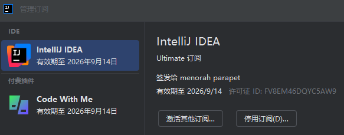

## 为什么

目前 [https://3.jetbra.in](https://3.jetbra.in) 站点因为未知原因挂掉了，此仓库是 2025/10 最后一次从该站点获取到的激活方式。适用于 IntelliJ IDEA 2025.2.6.1 (Ultimate Edition) 版本。

你在尝试此激活方案前，应该复查一遍 [https://3.jetbra.in](https://3.jetbra.in) 是否已经恢复可用。

## 操作步骤

```powershell
# 获取本仓库
git clone https://github.com/fnwind/idea-license-ja-netfilter.git

# 执行激活脚本
.\idea-license-ja-netfilter\ja-netfilter\scripts\install-all-users.vbs
```

然后启动 IDEA，在管理订阅中使用 [active-code.txt](active-code.txt) 中的激活码直接激活即可。



## 已知问题

1. 看起来许可在 **2026/09/14** 之后就到期了，后续不知道会怎么样；
2. **不要**再次打开管理订阅的页面，会导致激活失效；

## 相关链接

1. [vpen/gen-idea-code](https://gitee.com/vpen/gen-idea-code)
2. [ja-netfilter/ja-netfilter](https://gitee.com/ja-netfilter/ja-netfilter)